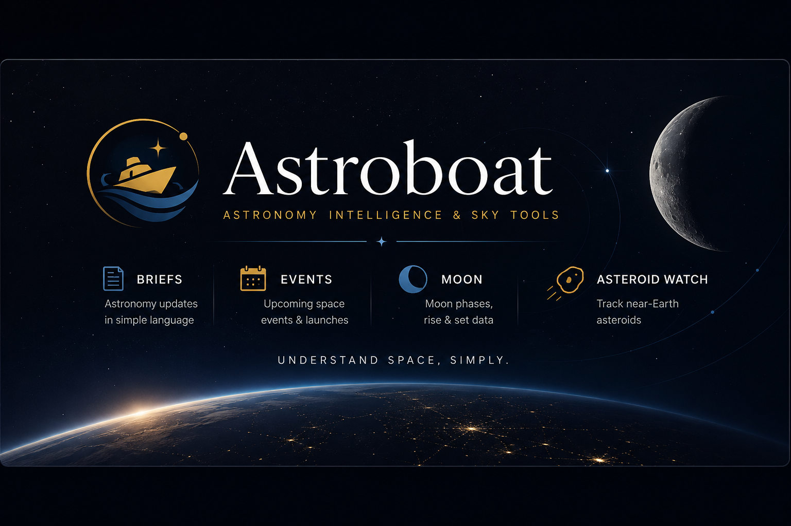
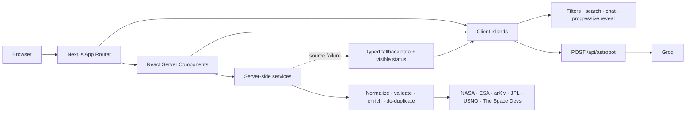

<p align="center">
  <a href="https://astroboat.in">
    
  </a>
</p>

<h1 align="center">Astroboat</h1>

<p align="center">
  <strong>Your calm observatory for a busy universe.</strong><br />
  Live astronomy briefs, launch and sky events, Moon intelligence, near-Earth-object tracking, and an astronomy-focused AI assistant—brought together in one cinematic interface.
</p>

<p align="center">
  <a href="https://astroboat.in"><strong>Launch Astroboat ↗</strong></a>
  &nbsp;&nbsp;·&nbsp;&nbsp;
  <a href="#mission-control">Explore the features</a>
  &nbsp;&nbsp;·&nbsp;&nbsp;
  <a href="#run-it-locally">Run it locally</a>
</p>

<p align="center">
  
  
  
  
  
</p>

---

Astroboat is an astronomy-focused web platform for people who want the signal without the noise. It gathers trusted public space data, normalizes it into a consistent model, and presents it as readable briefings and practical observing tools—not a wall of raw telemetry.

The product is built around three ideas: **source transparency**, **graceful failure**, and **beginner-friendly context**. Every live-data feature links back to its source, useful fallbacks keep the experience intact when providers fail, and technical measurements are translated into plain language.

## Mission control

| Module | What it does | Powered by |
| --- | --- | --- |
| **Astronomy Briefs** | Aggregates, searches, filters, enriches, and de-duplicates current astronomy stories | NASA, ESA, arXiv, Space.com, Universe Today |
| **Launch & Sky Events** | Tracks upcoming launches, mission events, eclipses, meteor activity, conjunctions, and recent events | The Space Devs + curated sky-event data |
| **Moon Dashboard** | Shows the current phase, illumination, rise/set times, observing guidance, and upcoming primary phases | U.S. Naval Observatory |
| **Asteroid Watch** | Monitors close approaches with distance, speed, size estimates, and calm risk context | JPL CNEOS CAD + NASA NeoWs fallback |
| **Ask Astroboat** | Answers astronomy questions with focused, concise explanations | Groq + Llama 3.3 by default |
| **Command Search** | Opens any core tool instantly with keyboard-first navigation | Local route index |

### Feature status

| Status | Capability |
| --- | --- |
| 🟢 **Live** | Home observatory, Briefs, Events, Moon, Asteroid Watch, global search, information and policy pages |
| 🟡 **Key required** | Ask Astroboat requires `GROQ_API_KEY`; NASA NeoWs is an optional asteroid fallback via `NASA_API_KEY` |
| ⏸️ **Paused in the UI** | Satellites, Articles, and Learn currently show intentional notice pages |
| 🧪 **Experimental** | The repository includes a standalone Vertex AI / Cloud Run assistant example; it is not connected to the production Next.js route |

## Inside Astroboat

### 🌌 Astronomy briefs

The Briefs pipeline is more than a feed reader:

- Collects nine RSS/Atom sources concurrently: NASA News, NASA Science, NASA Artemis, ESA Space Science, ESA Exploration, arXiv astro-ph, NASA APOD, Space.com, and Universe Today.
- Normalizes inconsistent XML, HTML, CDATA links, dates, authors, categories, and media into one `Brief` model.
- De-duplicates stories by normalized URL and title, orders them newest-first, and returns up to 40 current items.
- Produces deterministic short summaries, tags, reading-time estimates, categories, and “why it matters” context. These are code-generated—not AI-written.
- Enriches missing artwork from trusted article metadata, responsive image sets, APOD high-resolution media, and arXiv article figures.
- Uses source-aware generated SVG artwork when an article has no usable image.
- Supports instant text search, six editorial filters, a featured lead story, and progressive “load more” presentation.
- Links every story to the original publisher and exposes partial-source warnings rather than hiding degraded data.
- Falls back to bundled sample briefs only when every live feed is unavailable.

Individual brief pages include source, category, publication date, read time, summary, importance, optional beginner context, tags, original-source CTA, and route-aware metadata.

### 🚀 Launches and astronomical events

- Combines upcoming launches and spaceflight events from The Space Devs with curated sky phenomena.
- Merges, de-duplicates, sorts, and limits the result to a concise chronological stream.
- Filters by **Upcoming**, **Launches**, **Sky Events**, **Past**, **Eclipse**, **Meteor**, and **Conjunction**.
- Presents UTC date/time, status, provider, location, mission context, imagery, and a source link.
- Detects upstream rate limits and source failures, preserves working sources, and substitutes source-specific fallback data when necessary.

The current experience is a chronological event list rather than a traditional month-grid calendar. The service model also retains rocket, mission, webcast, visibility, and context fields for future interfaces.

### 🌙 Moon intelligence

- Renders the current lunar phase and illumination with an original SVG/CSS Moon visual.
- Shows moonrise, moonset, observing advice, next full/new Moon countdowns, and upcoming primary phases.
- Fetches daily rise/set and phase tables in parallel from the U.S. Naval Observatory.
- Converts raw observations into beginner guidance and photography/observing context.
- Identifies its source, observation date, and location, and clearly labels fallback data.

The active interface currently uses **Ahmedabad, India** (`23.0225, 72.5714`, UTC+05:30) as its fixed observing location. The service accepts coordinates, but a user-selectable location control is not yet exposed.

### ☄️ Asteroid Watch

- Uses JPL CNEOS Close-Approach Data as the keyless primary source.
- Monitors Earth approaches across the next 30 days, within 0.2 AU, and returns up to 20 objects.
- Falls back to NASA NeoWs for a seven-day window when `NASA_API_KEY` is configured, then to bundled data if both providers are unavailable.
- Converts raw values into kilometres, lunar distances, relative velocity, estimated diameter, and approachable size/distance context.
- Filters by **All**, **This Week**, **High Attention**, **Low Risk**, **Closest**, and **Fastest**, with progressive reveal.
- Includes a closest-pass visual, summary metrics, per-object source links, and provider/fallback status.

Astroboat’s “watch”, “notable”, and “safe” labels are interface heuristics for prioritizing the list. They are **not formal impact predictions**.

### ✦ Ask Astroboat

- Provides an astronomy-only assistant through `POST /api/astrobot`.
- Keeps the Groq API key on the server and sends only the current question upstream.
- Defaults to `llama-3.3-70b-versatile`, with a configurable model, a 1,000-character input limit, and concise responses.
- Includes starter prompts, sending/typing/error states, auto-scroll, and keyboard-friendly composition.
- Rejects invalid input, returns clear configuration errors, and sanitizes upstream failures.

The visible conversation is in-memory browser state: it resets on reload, is not stored in a database, and prior messages are not sent as model context. Responses are currently non-streaming. Current-data questions are directed to Astroboat’s dedicated live-data tools.

### ⌘ Command search and navigation

- Opens from the header or with <kbd>⌘</kbd>/<kbd>Ctrl</kbd> + <kbd>K</kbd>; <kbd>/</kbd> is also supported outside text fields.
- Searches a curated six-destination index by title, description, type, and keywords.
- Supports escape-to-close, focus restoration, scroll locking, empty states, and fast keyboard access.
- Uses a full desktop navigation at `xl` widths and a disclosure-style mobile/tablet menu below it.

Search is intentionally a **route launcher**, not a full-text search across live stories and data. Briefs have their own content search.

## Data sources, caching, and fallbacks

| Domain | Live source | Cache | Failure behavior |
| --- | --- | ---: | --- |
| Briefs | 9 NASA, ESA, arXiv, Space.com, and Universe Today feeds | 1 hour | Preserve healthy feeds → warn on partial data → bundled briefs if all fail |
| Brief artwork | Feed media + trusted original article pages | 1 hour | Advance through candidates → generated source/category visual |
| Launches & events | The Space Devs Launch Library 2 | 6 hours | Per-source fallback with rate-limit and stale-data messaging |
| Moon | USNO rise/set and phase APIs | 6 hours | Preserve available phase data → saved phase/rise-set fallback with notice |
| Asteroids | JPL CNEOS CAD | 6 hours | NASA NeoWs when configured → bundled objects |
| Assistant | Groq Chat Completions | No store | Actionable 400/503/502 response; no fabricated local answer |
| Satellite service *(dormant)* | Open Notify + optional N2YO | 5 min / 30 min | Bundled pass data; no active satellite UI |

All browser-facing astronomy data first passes through server-side services. External providers are never called directly from client components.

## Architecture



### End-to-end data flow

```text
Route (server) → service fetch → provider-specific parser → normalized type
→ cache/fallback decision → serializable props → interactive client component
→ filter/search/render state → original source link
```

Astroboat uses React Server Components by default and adds small client-side islands only where interaction is required. Native `fetch` and Next.js revalidation handle remote data—there is no database, ORM, global state library, or browser-side API secret.

## Routes

| Route | Rendering / behavior |
| --- | --- |
| `/` | Server-rendered observatory overview with current Moon and next event |
| `/briefs` | Live aggregated brief feed with client search, filters, and progressive loading |
| `/briefs/[slug]` | Dynamic story detail with source-aware metadata and 404 handling |
| `/events` | Live launch and sky-event stream with client filters |
| `/moon` | Server-rendered current Moon dashboard |
| `/asteroids` | Live close-approach data with client filters and progressive loading |
| `/ask` | Client chat interface backed by the server-only assistant route |
| `/api/astrobot` | Validated, no-store Groq proxy; accepts `POST { "message": string }` |
| `/about`, `/data-sources`, `/contact` | Product, provenance, and contact information |
| `/privacy`, `/terms` | Policy pages |
| `/articles`, `/learn`, `/satellites` | Intentional paused-feature notices |
| `/robots.txt`, `/sitemap.xml` | Generated crawler and discoverability files |

A global loading state is provided by the App Router. Astroboat currently relies on framework-level error/not-found handling except for explicit dynamic brief 404s.

## Technical stack

| Layer | Technology |
| --- | --- |
| Framework | Next.js 15.5, App Router only |
| UI | React 19.1, React Server Components + client islands |
| Language | TypeScript 5.7 in strict mode, `@/*` path alias |
| Styling | Tailwind CSS 3.4, PostCSS, custom CSS variables and keyframes |
| Feed parsing | `fast-xml-parser` |
| Data access | Native server-side `fetch`, Next.js time-based revalidation |
| AI | Groq Chat Completions; Llama 3.3 70B default |
| Fonts | DM Serif Display, DM Sans, JetBrains Mono via `next/font/google` |
| Visuals | Hand-built SVG/CSS Moon, orbit, timeline, sky-grid, and fallback artwork |
| SEO | Metadata API, canonicals, Open Graph, Twitter cards, JSON-LD, sitemap, robots |

There is no WebGL/Three.js dependency: the current space atmosphere is intentionally built with lightweight CSS and SVG. There is also no icon package or animation framework.

## Interface system

The visual language is an observatory—not a generic admin dashboard:

- **Palette:** near-black `#070a11`, layered navy surfaces, starlight gold `#d8b46a`, atmospheric blue `#8ecbe4`, and restrained semantic status colors.
- **Typography:** editorial serif display type, highly readable sans-serif body copy, and monospace telemetry.
- **Layout:** a centered 1,180 px content shell, responsive content grids, desktop navigation at `xl`, and mobile-first stacking.
- **Primitives:** `AstroCard`, `PageShell`, `PageHeader`, `SectionHeader`, `DataBadge`, `SourceBadge`, `FilterBar`, `MetricCard`, `LoadingState`, and `EmptyState`.
- **Motion:** star drift, orbital lines, subtle hover elevation, and state transitions, with `prefers-reduced-motion` support.
- **Resilience:** real image artwork when available, deterministic SVG fallbacks when not, and explicit loading/empty/error/degraded states.

Accessibility-minded details include semantic regions, visible focus states, keyboard-operated search, ARIA/live status messaging, descriptive image alternatives, and touch-friendly controls. These choices improve access, but the project does not currently claim formal WCAG certification.

## Reliability and security notes

- API keys and upstream data fetching stay server-side; only `NEXT_PUBLIC_SITE_URL` is intentionally public.
- Brief image enrichment is restricted to trusted publisher hostnames, validates redirects manually, limits redirect depth, bounds concurrency, and checks response content.
- XML and article content are normalized into plain typed data rather than injecting publisher HTML into the interface.
- Partial upstream failures remain visible and do not discard healthy provider results.
- Assistant input is validated and capped; upstream error details are not exposed directly to the client.
- The app has no authentication, persistent user storage, analytics, or application database.
- The assistant endpoint does not currently include per-user rate limiting; production operators should add platform-level abuse protection where appropriate.

## Run it locally

### Requirements

- [Node.js](https://nodejs.org/) 20 or newer
- npm
- Internet access for live astronomy sources and Google font downloads

### 1. Clone and install

```bash
git clone https://github.com/khushalx/astroboat-v2.git
cd astroboat-v2
npm ci
```

### 2. Configure the environment

Create `.env.local` in the project root:

```dotenv
# Required only for Ask Astroboat
GROQ_API_KEY=your_groq_api_key

# Optional assistant model override
GROQ_MODEL=llama-3.3-70b-versatile

# Optional: enables NASA NeoWs as the asteroid fallback
NASA_API_KEY=your_nasa_api_key

# Optional: canonical site origin; defaults to https://astroboat.in
NEXT_PUBLIC_SITE_URL=http://localhost:3000

# Dormant satellite service only; the /satellites UI is currently paused
# N2YO_API_KEY=your_n2yo_api_key
```

The core Briefs, Events, Moon, and primary JPL asteroid experiences work without API keys. Never commit `.env.local`.

### 3. Launch

```bash
npm run dev
```

Open [http://localhost:3000](http://localhost:3000).

## Scripts

| Command | Purpose |
| --- | --- |
| `npm run dev` | Start the local Next.js development server |
| `npm run build` | Create an optimized production build and validate types/routes |
| `npm run start` | Serve the production build |
| `npm run lint` | Run the configured Next.js lint command |

## Project map

```text
app/
├── api/astrobot/       # Server-only Groq route
├── briefs/[slug]/      # Dynamic brief detail
├── briefs/             # Aggregated astronomy news
├── events/             # Launch and sky-event stream
├── moon/               # Lunar dashboard
├── asteroids/          # Near-Earth-object watch
├── ask/                # Assistant UI
├── globals.css         # Tokens, typography, atmosphere, motion
├── layout.tsx          # Global metadata, shell, header, footer, search
├── sitemap.ts          # Generated sitemap
└── robots.ts           # Generated robots rules

components/
├── briefs/             # Brief cards, images, filters, fallbacks
├── events/             # Event client and resilient imagery
├── asteroids/          # NEO filters, metrics, approach visual
├── ask/                # In-memory assistant client
├── layout/             # Header, mobile navigation, footer
├── search/             # Global command search
├── ui/                 # Shared design-system primitives
└── visuals/            # SVG/CSS astronomy visuals

services/               # Provider clients, parsers, normalization, fallbacks
lib/                    # Shared types, constants, utilities, mock data, search index
public/                 # Social artwork, icons, and brand assets
cloud-run-astrobot-example/
                        # Standalone Vertex AI/Express experiment—not wired to Next.js
```

### Repository archaeology

Some code is intentionally retained but not mounted in the active product:

- `SatelliteFinderClient` and `satellites-service` contain an Open Notify/N2YO prototype while `/satellites` remains paused.
- Article and learning services contain sample content while `/articles` and `/learn` remain paused.
- Several older home/visual components are no longer imported by active pages.
- Root-level `index.html`, `app.js`, `styles.css`, and `sources.js` belong to an earlier standalone prototype and are not part of the Next.js application.
- `cloud-run-astrobot-example` is a separate deployment example; the active assistant uses Groq directly and does not read `ASTROBOT_BACKEND_URL`.

## Current product boundaries

- Global search launches core routes; it does not index every story or live object.
- Moon calculations are currently presented for one fixed location.
- Event discovery is chronological, not a month-grid calendar.
- Briefs are limited to the newest normalized set; dynamic brief URLs are not currently emitted in the sitemap.
- Chat history is temporary and single-turn at the model layer.
- No account system, saved items, notifications, database, automated test suite, analytics integration, or CI workflow is currently included.
- The repository currently has no license file; source availability should not be interpreted as a grant of reuse rights.

## Build and deployment

Astroboat is a standard server-capable Next.js application:

```bash
npm run build
npm run start
```

Deploy it to any Node-compatible Next.js host with outbound access to the listed data providers. A pure static export is not supported because the application uses server-side external fetches and an API route. Set `NEXT_PUBLIC_SITE_URL` to the production origin so canonical metadata, the sitemap, and robots output use the correct host.

---

<p align="center">
  Designed and built by <a href="https://github.com/khushalx"><strong>Khushal Dangar</strong></a>.<br />
  <sub>Built for curious minds looking up.</sub>
</p>
